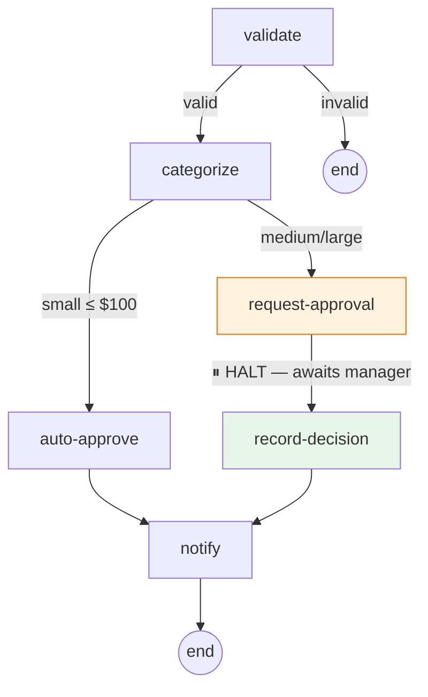

# Expense Approval Example

A human-in-the-loop expense approval workflow demonstrating Mycelium's halt/resume and `WorkflowStore` persistence.

## Running

```bash
cd examples/expense_approval
clj -M:test
```

## Domain

Employees submit expense reports. Small expenses are auto-approved; larger ones halt the workflow and wait for a manager to approve or reject via the persistent store.

### Decision Flow



## Store Lifecycle

```clojure
(require '[mycelium.store :as store])

(def s (store/memory-store))

;; 1. Employee submits $750 expense → halts for approval
(def halted (store/run-with-store compiled {} expense-data s))
;; => {:mycelium/session-id "abc-123", :mycelium/halt {:reason :manager-approval-needed, ...}}

;; 2. Later — manager looks up pending workflows
(store/list-workflows s)
;; => ("abc-123")

;; 3. Manager approves
(store/resume-with-store compiled {} "abc-123" s {:manager-approved true, :manager-name "eve"})
;; => {:decision :approved, :notification {...}, ...}

;; 4. Session automatically cleaned up
(store/list-workflows s)
;; => ()
```

## Cells

| Cell | Purpose | Halts? |
|------|---------|--------|
| `:expense/validate` | Check required fields | No |
| `:expense/categorize` | Route by amount | No |
| `:expense/auto-approve` | Approve small expenses | No |
| `:expense/request-approval` | Halt for manager review | **Yes** |
| `:expense/record-decision` | Record approve/reject after resume | No |
| `:expense/notify` | Send notification | No |

## Mycelium Features Exercised

- **Halt/resume** — `request-approval` halts with context; `record-decision` runs after resume with manager input
- **WorkflowStore** — `run-with-store` / `resume-with-store` for persistent session management
- **`:default` transitions** — invalid expenses and non-small categories route via `:default`
- **Per-transition output schemas** — `validate` declares different output for `:valid` vs `:invalid`
- **Schema chain validation** — compile-time verification that each cell receives required keys

## File Structure

```
src/expense/
  cells.clj         6 cell registrations
  workflows.clj     workflow definition + pre-compilation

test/expense/
  workflow_test.clj  8 tests — direct run/resume + store-backed lifecycle
```
