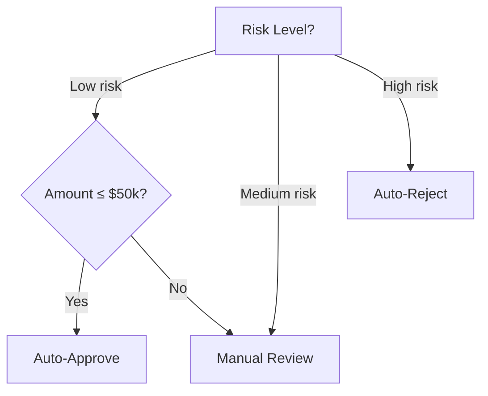
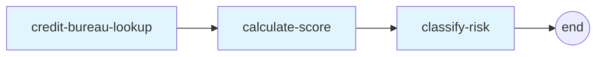
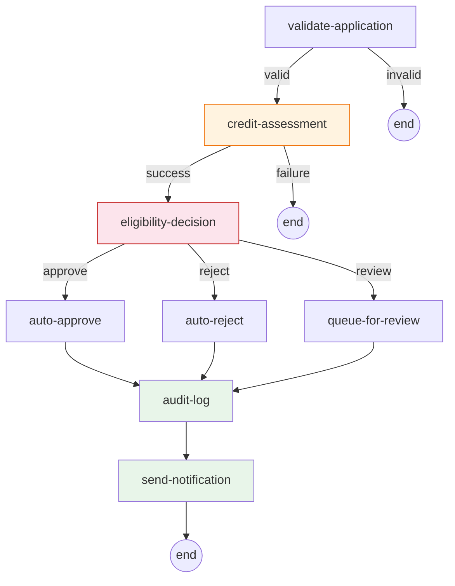
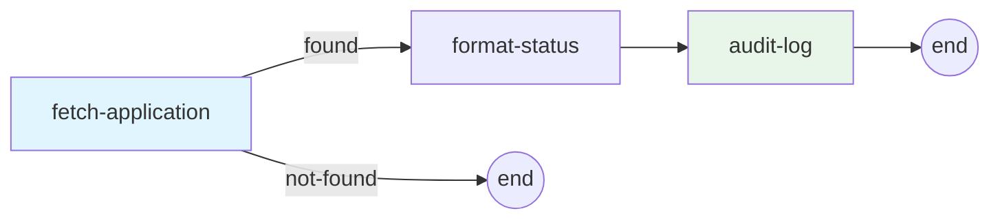
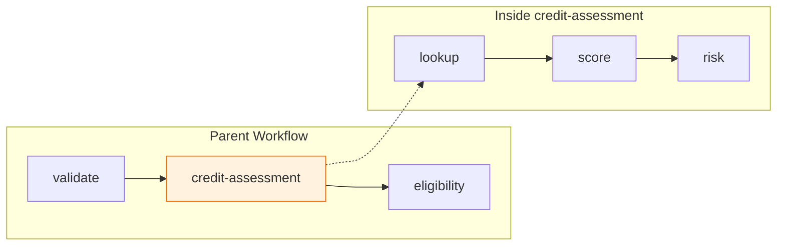
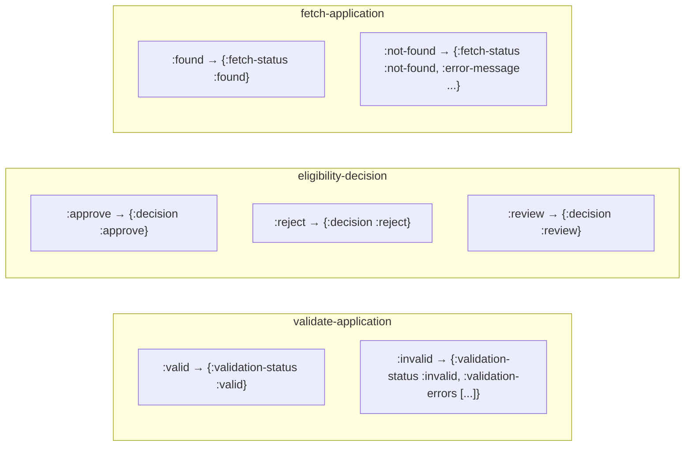
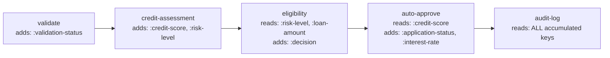
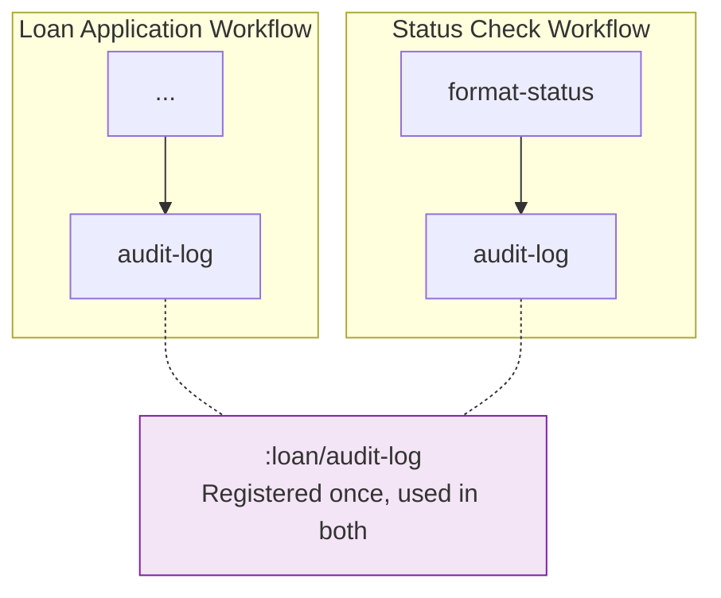

# Loan Processing Example

A pure-workflow example (no DB, no HTTP, no templates) that exercises Mycelium's
core features through a realistic loan application domain.

## Running

```bash
cd examples/loan_processing
clj -M:test
```

## Domain

Three workflows process loan applications through validation, credit assessment,
eligibility routing, and notifications — all with in-memory data.

### Test Applicants

| Name  | Credit Profile | Typical Outcome |
|-------|---------------|-----------------|
| Alice | 5 accounts, 10yr history, clean record | Low risk (score ~850) → auto-approve |
| Bob   | 3 accounts, 5yr history, 1 late payment | Medium risk (score ~650) → manual review |
| Carol | 1 account, 2yr history, 5 late + 1 bankruptcy | High risk (score 300) → auto-reject |

### Decision Rules



## Workflows

### 1. Credit Assessment (subworkflow)

A linear pipeline registered as a single composed cell (`:loan/credit-assessment`) for embedding in the main workflow. Output keys are **automatically inferred** — no `set-cell-schema!` workaround needed.



**Data flow:**

| Cell | Reads | Produces |
|------|-------|----------|
| credit-bureau-lookup | `:applicant-name` | `:credit-history` |
| calculate-score | `:credit-history` | `:credit-score` (300–850) |
| classify-risk | `:credit-score` | `:risk-level` (`:low`/`:medium`/`:high`) |

### 2. Loan Application (main workflow)

The main branching workflow with early exit, subworkflow composition, 3-way branching, and convergence.



**Key patterns illustrated:**

- **Early exit** — invalid applications route straight to `:end`, skipping all downstream processing
- **Subworkflow composition** — `credit-assessment` is a composed cell running 3 internal cells, appearing as one node in the parent graph
- **3-way branching** — `eligibility-decision` fans out to three decision outcomes using per-transition output schemas
- **Convergence** — all three branches reconverge at `audit-log`, sharing the same downstream pipeline
- **Cell reuse** — `audit-log` and `send-notification` execute regardless of which branch was taken

### 3. Application Status Check

A simple branching workflow that reuses cells from the main workflow.



Reuses `:loan/fetch-application` and `:loan/audit-log` from the same cell registry.

## Mycelium Features Exercised

### Subworkflow Composition & Output Inference

The credit assessment pipeline is registered as a cell with `compose/register-workflow-cell!`.
Mycelium **automatically infers** the composed cell's output schema by walking the child
workflow's end-reaching cells, so the parent's schema chain validator sees `:credit-score`
and `:risk-level` without manual overrides.



### Per-Transition Output Schemas

Several cells declare different output schemas per dispatch path:



The schema chain validator verifies each downstream cell receives exactly the keys
it needs on each specific path.

### Schema Chain — Accumulating Data

The data map accumulates across cells. Each cell sees everything produced upstream:



### Cell Reuse Across Workflows



### Dev Testing Utilities

Cell unit tests use `dev/test-cell` for isolated single-path testing and
`dev/test-transitions` for multi-path testing in a single call. Both perform
full schema validation (input + output) and dispatch matching. Cells without
dispatch predicates (like `classify-risk`) can also use `test-transitions` for
output-only validation across multiple input scenarios.

## File Structure

```
src/loan/
  cells.clj         12 cell registrations (defmethod cell/cell-spec)
  workflows.clj     3 workflow definitions + composed cell registration

test/loan/
  cells_test.clj    22 unit tests — each cell tested in isolation
  workflows_test.clj 14 integration tests — every path through each workflow
```

## Cells

| Cell | Purpose | Key I/O |
|------|---------|---------|
| `:loan/validate-application` | Check required fields | → `:validation-status` |
| `:loan/credit-bureau-lookup` | Look up credit history from in-memory DB | → `:credit-history` |
| `:loan/calculate-score` | Compute credit score (300–850) from history | → `:credit-score` |
| `:loan/classify-risk` | Map score to `:low`/`:medium`/`:high` | → `:risk-level` |
| `:loan/eligibility-decision` | Route based on risk + amount (3-way) | → `:decision` |
| `:loan/auto-approve` | Set approved status + interest rate | → `:application-status`, `:interest-rate` |
| `:loan/auto-reject` | Set rejected status + reason | → `:application-status`, `:decision-reason` |
| `:loan/queue-for-review` | Set pending status + queue assignment | → `:application-status`, `:review-queue` |
| `:loan/send-notification` | Generate notification from current status | → `:notification` |
| `:loan/audit-log` | Append entry to audit trail vector | → `:audit-trail` |
| `:loan/fetch-application` | Look up stored application | → `:fetch-status` |
| `:loan/format-status` | Format human-readable status report | → `:status-report` |
