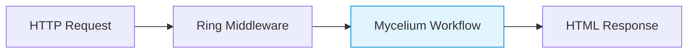
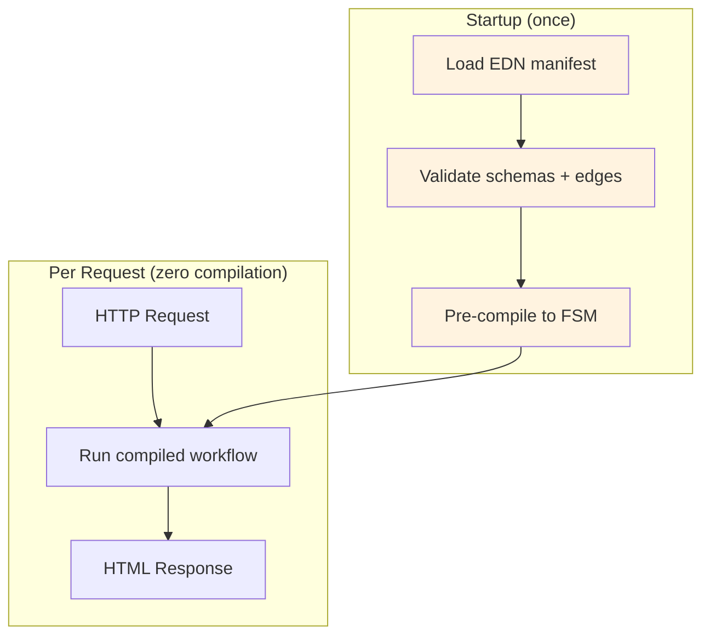
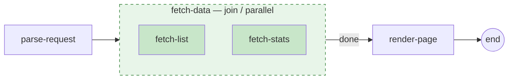
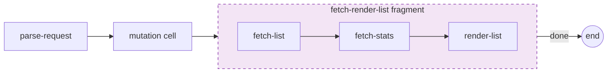
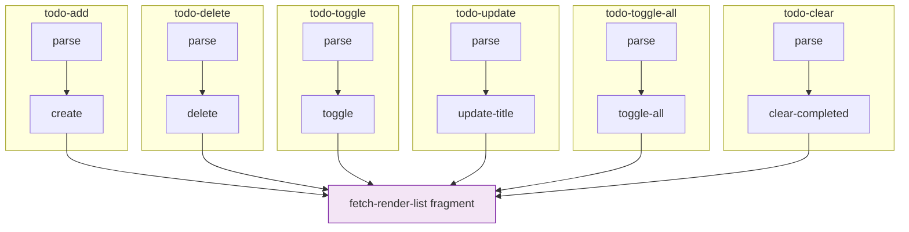
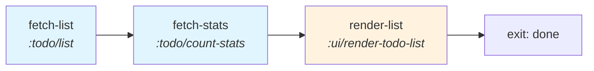
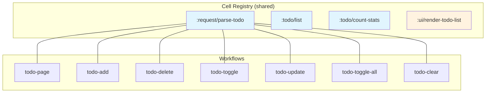

# TodoMVC

A full TodoMVC implementation built with Mycelium workflows, HTMX, and SQLite.
Each HTTP endpoint is backed by a pre-compiled Mycelium workflow defined in EDN manifests.

## Running

Start a [REPL](#repls) in your editor or terminal of choice.

Start the server with:

```clojure
(go)
```

The app is available at http://localhost:3000

System configuration is available under `resources/system.edn`.

To reload changes:

```clojure
(reset)
```

## Architecture

Every HTTP request flows through the same pipeline:



Workflows are defined as **EDN manifests**, loaded at startup, and **pre-compiled** for zero overhead per request. Ring's `workflow-handler` bridges HTTP to workflow execution.



## Workflows

### Page Load — Full Page Render

The page workflow uses a **join node** to fetch todos and stats in parallel, then renders the full page.



**Key pattern: Fork-join parallel execution.** Both `fetch-list` and `fetch-stats` receive the same data snapshot and run concurrently. Their results are merged before `render-page`.

### CRUD Operations — Shared Fragment Pattern

All mutation workflows (add, delete, toggle, update, toggle-all, clear) follow the same structure:



The tail is a **reusable fragment** (`fragments/fetch-render-list.edn`) shared across all 6 mutation workflows. Only the mutation cell changes:



### Fragment Detail

The `fetch-render-list` fragment is defined once and inlined into each workflow at compile time:



## Mycelium Features Exercised

### EDN Manifest Workflows

All 7 workflows are defined as pure EDN files — no Clojure code in the workflow definitions:

```
resources/workflows/
  todo-page.edn         Full page render (with join)
  todo-add.edn          Create todo
  todo-delete.edn       Delete todo
  todo-toggle.edn       Toggle single todo
  todo-update.edn       Update todo title
  todo-toggle-all.edn   Toggle all todos
  todo-clear.edn        Clear completed
  fragments/
    fetch-render-list.edn   Shared tail fragment
```

### Reusable Fragments

The fragment system allows shared workflow sub-graphs:

```clojure
;; In todo-add.edn:
{:fragments
 {:tail {:ref   "fragments/fetch-render-list.edn"
         :as    :fetch-list
         :exits {:done :end}}}}
```

At manifest load time, the fragment's cells and edges are inlined into the host workflow. The `:as` key provides the entry point, and `:exits` maps the fragment's exit labels to host targets.

### Join Nodes (Parallel Execution)

The page workflow demonstrates parallel execution with a join:

```clojure
;; In todo-page.edn:
{:joins
 {:fetch-data {:cells    [:fetch-list :fetch-stats]
               :strategy :parallel}}}
```

Both cells run concurrently with snapshot semantics — each receives the same input data. Results are merged before the next cell.

### Cell Reuse Across Workflows

Cells are registered once and referenced by ID across all 7 workflows:



`:request/parse-todo` and `:todo/list` appear in **all 7 workflows** — defined once, tested once, reused everywhere.

### Pre-Compilation

All workflows are pre-compiled at namespace load time:

```clojure
(def compiled-page   (load-and-compile "todo-page.edn"))
(def compiled-add    (load-and-compile "todo-add.edn"))
;; ... etc
```

Zero compilation overhead per HTTP request.

### Ring Middleware Integration

Routes use `workflow-handler` to bridge HTTP to workflows:

```clojure
(defn- wf-handler [compiled db]
  (mw/workflow-handler compiled {:resources {:db db}}))

(defn page-routes [db]
  [["/"                        {:get   {:handler (wf-handler wf/compiled-page db)}}]
   ["/todos"                   {:post  {:handler (wf-handler wf/compiled-add db)}}]
   ["/todos/:id/toggle"        {:patch {:handler (wf-handler wf/compiled-toggle db)}}]
   ["/todos/:id"               {:delete {:handler (wf-handler wf/compiled-delete db)}
                                 :put    {:handler (wf-handler wf/compiled-update db)}}]
   ...])
```

### Schema Validation at Every Boundary

Every cell input/output is validated at runtime. Request parsing failures and schema violations redirect to the error state with diagnostics.

## Cells

| Cell | Purpose | Resource |
|------|---------|----------|
| `:request/parse-todo` | Parse HTTP request params (path, form, query) | — |
| `:todo/list` | Fetch filtered todos from SQLite | `:db` |
| `:todo/count-stats` | Count active/completed/total | `:db` |
| `:todo/create` | Insert new todo | `:db` |
| `:todo/delete` | Delete todo by ID | `:db` |
| `:todo/toggle` | Toggle completion status | `:db` |
| `:todo/update-title` | Update todo title | `:db` |
| `:todo/toggle-all` | Toggle all todos | `:db` |
| `:todo/clear-completed` | Delete all completed todos | `:db` |
| `:ui/render-todo-page` | Render full HTML page (Selmer) | — |
| `:ui/render-todo-list` | Render todo list fragment (Selmer) | — |

## HTTP Routes

| Method | Path | Workflow | Description |
|--------|------|----------|-------------|
| GET | `/` | todo-page | Full page render |
| POST | `/todos` | todo-add | Create new todo |
| PATCH | `/todos/:id/toggle` | todo-toggle | Toggle completion |
| DELETE | `/todos/:id` | todo-delete | Delete todo |
| PUT | `/todos/:id` | todo-update | Update title |
| POST | `/todos/toggle-all` | todo-toggle-all | Toggle all |
| POST | `/todos/clear-completed` | todo-clear | Clear completed |

## File Structure

```
src/clj/mycelium/todomvc/
  workflows/todo.clj           Load + pre-compile all manifests
  cells/
    request.clj                HTTP request parsing cells
    todo.clj                   Database operation cells
    ui.clj                     Selmer template rendering cells
  web/routes/
    pages.clj                  Ring routes → workflow handlers

resources/
  workflows/                   EDN manifest files (7 workflows)
    fragments/                 Reusable fragment definitions
  html/                        Selmer templates

test/mycelium/todomvc/
  cells/                       Cell unit tests
  workflows/                   Integration tests
```

## REPLs

### Cursive

Configure a [REPL following the Cursive documentation](https://cursive-ide.com/userguide/repl.html). Using the default "Run with IntelliJ project classpath" option will let you select an alias from the ["Clojure deps" aliases selection](https://cursive-ide.com/userguide/deps.html#refreshing-deps-dependencies).

### CIDER

Use the `cider` alias for CIDER nREPL support (run `clj -M:dev:cider`). See the [CIDER docs](https://docs.cider.mx/cider/basics/up_and_running.html) for more help.

### Command Line

Run `clj -M:dev:nrepl` or `make repl`.
