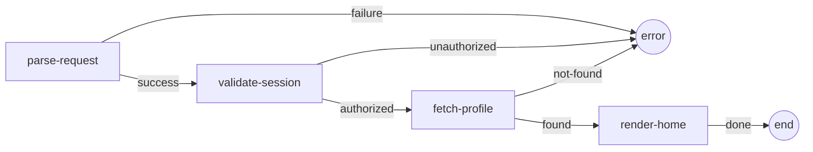

# User Onboarding Example

A complete web application demonstrating Mycelium's manifest-driven workflow orchestration. The app authenticates a user, fetches their profile from a database, and renders a welcome response — all defined as composable cells wired together by an EDN manifest.

## Workflow



Each box is a **cell** — an isolated unit with a defined handler, input/output schema, and declared transitions. The manifest (`resources/workflows/user-onboarding.edn`) is the single source of truth for schemas and wiring.

## Project Structure

```
user_onboarding/
├── deps.edn                                  # Dependencies & aliases
├── tests.edn                                 # Kaocha test config
├── resources/
│   ├── system.edn                            # Integrant system config
│   ├── workflows/
│   │   └── user-onboarding.edn               # Workflow manifest (schemas + edges)
│   └── migrations/
│       ├── 20240101000000-initial-schema.up.sql
│       └── 20240101000000-initial-schema.down.sql
├── src/app/
│   ├── core.clj                              # Entry point (Integrant lifecycle)
│   ├── routes.clj                            # Ring/Reitit HTTP routes
│   ├── db.clj                                # Database queries
│   ├── workflows/
│   │   └── onboarding.clj                    # Loads manifest, runs workflow
│   └── cells/
│       ├── auth.clj                          # :auth/parse-request, :auth/validate-session
│       ├── user.clj                          # :user/fetch-profile
│       └── ui.clj                            # :ui/render-home
└── test/app/
    ├── cells/
    │   ├── auth_test.clj                     # Unit tests for auth cells
    │   ├── user_test.clj                     # Unit tests for user cell
    │   └── ui_test.clj                       # Unit tests for UI cell
    └── integration_test.clj                  # End-to-end workflow tests
```

## How It Works

1. **Cells** (`src/app/cells/`) define handlers and transitions via `defcell` — no schemas here.
2. **Manifest** (`resources/workflows/user-onboarding.edn`) declares schemas, edges, and wiring for each cell.
3. **Workflow loader** (`src/app/workflows/onboarding.clj`) loads the manifest and calls `manifest->workflow`, which attaches schemas to registered cells and produces a compilable workflow definition.
4. **Routes** (`src/app/routes.clj`) bridge HTTP requests into the workflow via `run-onboarding`.
5. **Integrant** (`src/app/core.clj`) manages the system lifecycle: database, migrations, handler, and Jetty server.

## Running

Start the server on port 3000:

```bash
clj -M:run
```

Test with curl:

```bash
# Successful authentication + profile fetch
curl -X POST http://localhost:3000/api/onboarding \
  -H "Content-Type: application/json" \
  -d '{"username": "alice", "token": "tok_abc123"}'

# Health check
curl http://localhost:3000/api/health
```

## Testing

Run all tests (unit + integration):

```bash
clj -M:test
```

The test suite includes:
- **Unit tests** — each cell tested in isolation via `dev/test-cell`
- **Integration tests** — full workflow execution against a temporary SQLite database

## Database

Uses SQLite with automatic migrations via Migratus. The initial migration creates `users` and `sessions` tables with seed data:

| User  | Token          | Valid |
|-------|----------------|-------|
| alice | tok_abc123     | yes   |
| bob   | tok_bob456     | yes   |
| alice | tok_expired    | no    |
