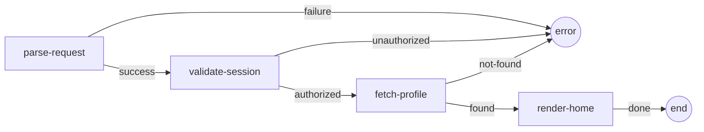
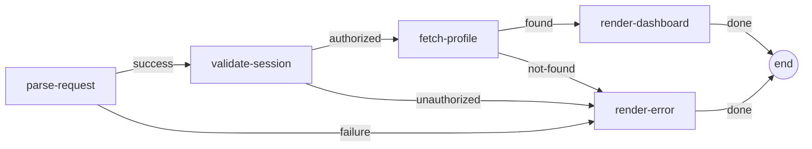
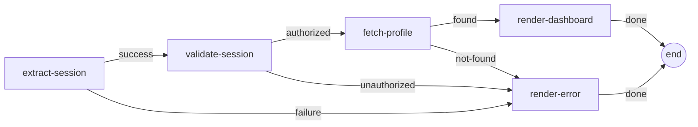
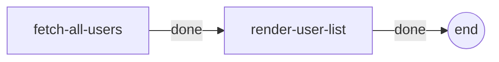
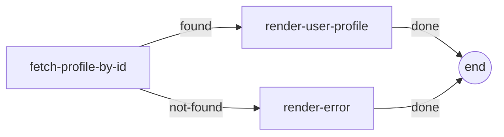
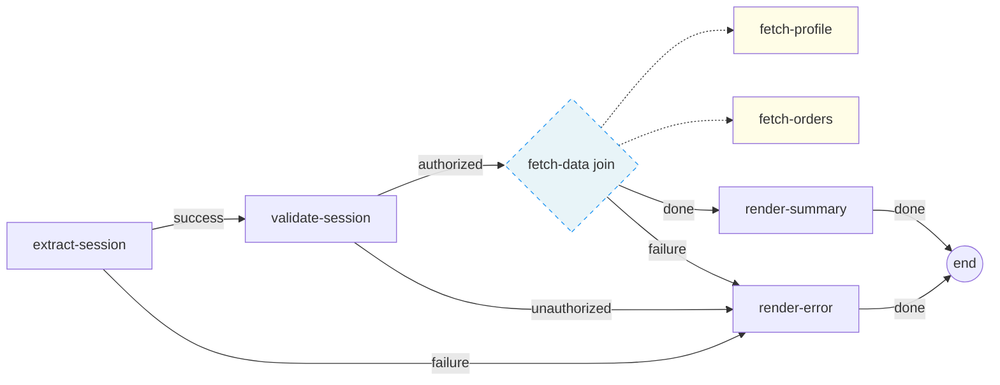

# User Onboarding Example

A complete web application demonstrating Mycelium's manifest-driven workflow orchestration. The app authenticates a user, fetches their profile from a database, and renders responses — all defined as composable cells wired together by EDN manifests. Includes both a JSON API and a full HTML frontend powered by Selmer templates.

## Workflows

### JSON API — User Onboarding



### HTML — Login Submit



### HTML — Dashboard



### HTML — User List



### HTML — User Profile



### JSON API — Order Summary (join node)



This workflow uses a **join node** (`:fetch-data`) to run `:fetch-profile` and `:fetch-orders` in parallel. Both members receive the same input snapshot (containing `:user-id` from `:validate-session`) and their outputs are merged into a single data map. `:render-summary` then sees both `:profile` and `:orders` — the join guarantees disjoint output keys at compile time.

The join replaces the previous linear chain with explicit parallel execution, compile-time conflict detection, and snapshot semantics that ensure deterministic results regardless of execution order.

Each box is a **cell** — an isolated unit with a defined handler and input/output schema. The manifests (`resources/workflows/*.edn`) are the single source of truth for schemas, edges, and dispatch predicates.

## Project Structure

```
user_onboarding/
├── deps.edn                                  # Dependencies & aliases
├── tests.edn                                 # Kaocha test config
├── resources/
│   ├── system.edn                            # Integrant system config
│   ├── templates/                            # Selmer HTML templates
│   │   ├── base.html                         # Base layout with nav + CSS
│   │   ├── login.html                        # Login form
│   │   ├── dashboard.html                    # Dashboard page
│   │   ├── error.html                        # Error page (401/404/etc)
│   │   ├── users.html                        # User list table
│   │   └── profile.html                      # Single user profile
│   ├── workflows/
│   │   ├── user-onboarding.edn               # JSON API workflow
│   │   ├── login-page.edn                    # Login form page
│   │   ├── login-submit.edn                  # Login form submission
│   │   ├── dashboard.edn                     # Dashboard (token-based)
│   │   ├── user-list.edn                     # All users list
│   │   ├── user-profile.edn                  # Single user profile
│   │   └── order-summary.edn                 # Order summary (multi-source inputs)
│   └── migrations/
│       ├── 20240101000000-initial-schema.up.sql
│       ├── 20240101000000-initial-schema.down.sql
│       ├── 20240102000000-add-orders.up.sql
│       └── 20240102000000-add-orders.down.sql
├── src/app/
│   ├── core.clj                              # Entry point (Integrant lifecycle)
│   ├── routes.clj                            # Ring/Reitit HTTP routes
│   ├── db.clj                                # Database queries
│   ├── workflows/
│   │   ├── onboarding.clj                    # JSON API workflow loader
│   │   ├── login.clj                         # Login page + submit loaders
│   │   ├── dashboard.clj                     # Dashboard workflow loader
│   │   ├── users.clj                         # User list/profile loaders
│   │   └── order_summary.clj                 # Order summary loader
│   └── cells/
│       ├── auth.clj                          # :auth/parse-request, :auth/validate-session, :auth/extract-session
│       ├── user.clj                          # :user/fetch-profile, :user/fetch-all-users, :user/fetch-profile-by-id, :user/fetch-orders
│       └── ui.clj                            # :ui/render-home, :ui/render-login-page, :ui/render-dashboard, :ui/render-error, :ui/render-user-list, :ui/render-user-profile, :ui/render-order-summary
└── test/app/
    ├── cells/
    │   ├── auth_test.clj                     # Unit tests for auth cells
    │   ├── user_test.clj                     # Unit tests for user cells
    │   └── ui_test.clj                       # Unit tests for UI cells
    ├── integration_test.clj                  # End-to-end workflow tests
    └── multi_source_input_test.clj           # Multi-source input tests (order summary)
```

## How It Works

1. **Cells** (`src/app/cells/`) define handlers via `defmethod cell/cell-spec` — pure data transformations, no routing logic.
2. **Manifests** (`resources/workflows/*.edn`) declare schemas, edges, and dispatch predicates for each cell.
3. **Workflow loaders** (`src/app/workflows/`) load manifests and call `manifest->workflow`, which attaches schemas to registered cells and produces compilable workflow definitions.
4. **Routes** (`src/app/routes.clj`) bridge HTTP requests into workflows. JSON API routes use Muuntaja for content negotiation. HTML routes use a generic `html-handler` that maps workflow results to Ring responses.
5. **Integrant** (`src/app/core.clj`) manages the system lifecycle: database, migrations, handler, and Jetty server.

## Routes

| Method | Path | Description |
|--------|------|-------------|
| GET | `/api/health` | Health check (JSON) |
| POST | `/api/onboarding` | JSON API workflow |
| GET | `/login` | Login form page |
| POST | `/login` | Submit login, render dashboard or error |
| GET | `/dashboard?token=...` | Dashboard (requires session token) |
| GET | `/users` | User list page |
| GET | `/users/:id` | User profile page |

## Running

Start the server on port 3000:

```bash
clj -M:run
```

Test with curl:

```bash
# JSON API — successful authentication + profile fetch
curl -X POST http://localhost:3000/api/onboarding \
  -H "Content-Type: application/json" \
  -d '{"username": "alice", "token": "tok_abc123"}'

# Health check
curl http://localhost:3000/api/health

# HTML pages
open http://localhost:3000/login
open http://localhost:3000/dashboard?token=tok_abc123
open http://localhost:3000/users
open http://localhost:3000/users/alice
```

## Testing

Run all tests (unit + integration):

```bash
clj -M:test
```

The test suite includes:
- **Unit tests** — each cell tested in isolation via `dev/test-cell`
- **Integration tests** — full workflow execution against a temporary SQLite database

## Database

Uses SQLite with automatic migrations via Migratus. The initial migration creates `users` and `sessions` tables with seed data. A second migration adds the `orders` table:

| User  | Token          | Valid |
|-------|----------------|-------|
| alice | tok_abc123     | yes   |
| bob   | tok_bob456     | yes   |
| alice | tok_expired    | no    |

| Order   | User  | Item        | Amount |
|---------|-------|-------------|--------|
| ord_001 | alice | Widget Pro  | 29.99  |
| ord_002 | alice | Gadget Max  | 49.99  |
| ord_003 | bob   | Widget Pro  | 29.99  |
